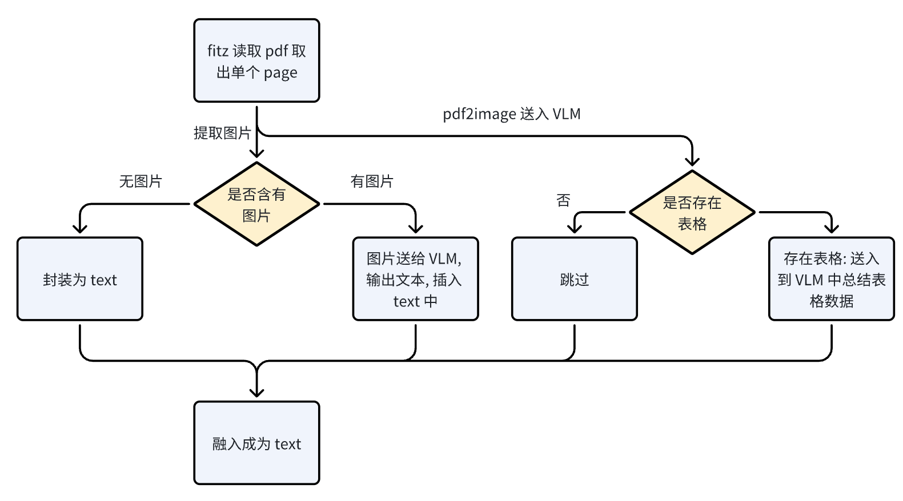
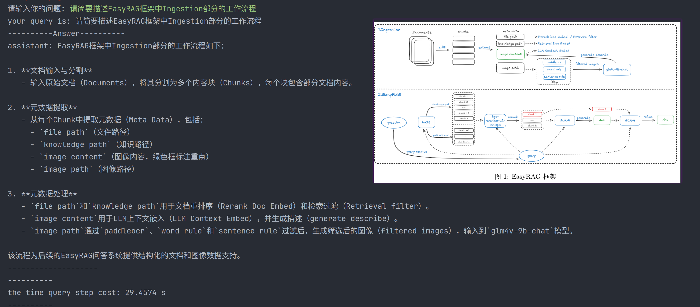
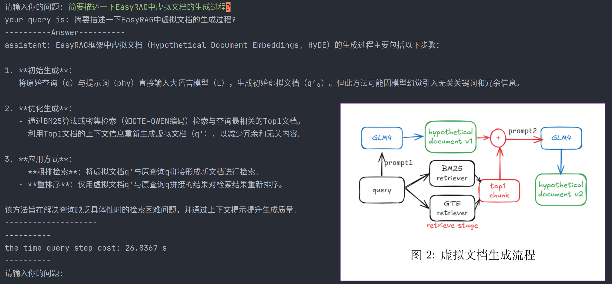
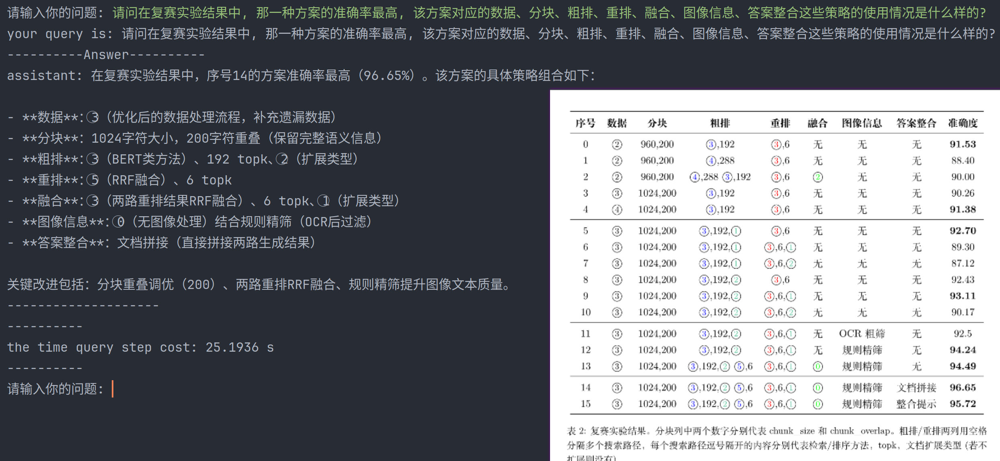

# XRAG

> `XRAG` 是一个基础的 `RAG` 框架, 目前实现了基础的 `RAG` 系统, 同时实现了 `Multi Query`、`HyPE`、`Rerank` 等优化方法, 同时基于 `ragas` 构建了 `RAG` 评估系统 ; `XRAG` 使用到了 `llama_index` 框架, 但是只是使用到 `llama_index` 中 `prompt`、`model`、`Document`、`splitter` 相关的部分, 数据加载以及存储部分是自己实现的

`XRAG` 主要包含如下模块:

- `ingestion`: 数据处理模块, 包含数据加载、数据切片、向量数据库存储、检索器以及虚拟文档生成等功能
- `query_engine`:  知识库以及模型的集成, 实现基于 `Multi Query` 的 `RAG` 系统
- `model`: 用于模型的管理

- `eval`:  用于 `RAG` 系统的评估

- `prompt`: 用于管理 `prompt` 

## Feature

### 数据加载模块

`XRAG` 使用 `fitz` + 多模态大模型实现了对于 `PDF` 文本、图片以及表格的解析, 数据加载模块实现逻辑如下:

## RAG 优化

### Rerank

`XRAG` 中利用 `Rerank` 模型实现 `Rerank`

### Multi-Query

`XRAG` 中实现了 `Multi Query` 增大相关文本被检索到的概率, 实现逻辑可以参考: [`query_engine.py`](./chatbot/query_engine.py)

### HyPE

`XRAG` 实现 `HyPE`(虚拟文档生成), 利用虚拟文档实现对于文本相关内容的检索, 实现逻辑可以参考: [`retriever.py`](./ingestion/retriever.py)

## 效果

### 基于图片提问

### 基于表格提问

## TODO

- [ ] `GraphRAG`

